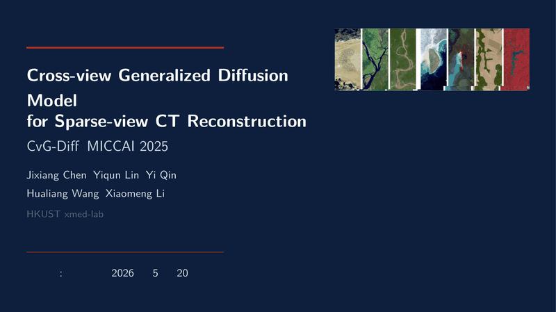

<h1 align="center">Beamer Deck Auto</h1>

<p align="center">
  <b>A design-engineered slide system for XeLaTeX Beamer.</b><br>
  Three-tier template library · Four-layer layout optimizer · Design grammar checker · AI agent skills
</p>

<p align="center">
  <a href="#quickstart">Quickstart</a> ·
  <a href="#features">Features</a> ·
  <a href="#showcase">Showcase</a> ·
  <a href="#installation">Install</a>
</p>

---

## Why Beamer Deck Auto?

Building academic slides with LaTeX Beamer usually means:
- **Guessing layouts** — Will this figure fit on the left? Should I use `columns` or `minipage`?
- **Manual tweaking** — Adjusting `\vspace{-2ex}` until the slide stops overflowing
- **No quality gate** — "Looks fine to me" — but the audience sees unbalanced columns and loose text

**Beamer Deck Auto** replaces guesswork with a systematic pipeline:

<p align="center">
  
</p>

1. **Parse** — Extract content from PDF papers (text, figures, references)
2. **Optimize** — 4-layer decision tree picks the best layout template automatically
3. **Build** — XeLaTeX + xeCJK with auto font detection, two-pass for perfect alignment
4. **Audit** — U/B/G/DGV metrics catch visual problems before your audience does

> **"Design before density"** — Layout choice first, content second, polish last.

---

## Features

### 🎨 Three-Tier Template Library

| Tier | What | Count | Example |
|------|------|-------|---------|
| **Themes** | Color + typography palettes | 4 | Navy+Red, Teal+Amber, Dark+Gold, Navy+Gold |
| **Layouts** | Page structure patterns | 8 | Text, 1-img, 2-img, 3-img, eq, table, img-top, twocol |
| **Components** | Reusable content blocks | 12+ | Info card, alert, result, equation box, figure helper |

<p align="center">
  
  
</p>
<p align="center">
  
</p>

### 🧠 Four-Layer Layout Optimizer

`layout_optimizer.py` makes layout decisions like a senior designer:

| Layer | Decision | Example |
|-------|----------|---------|
| **L1 Template** | Aspect ratio → layout family | Wide figure → `imgtop` · Square figure → `1img` side |
| **L2 Constraints** | Column balance, natural image height | Prevent 30/70 splits, cap image at 76% frame height |
| **L3 Density** | Text fills 60–85% of slot | Too sparse → add content; too dense → split slide |
| **L4 Grammar** | Hard design rules | No loose text outside boxes · No gold callout in columns · Max 3 blocks/slide |

```bash
# Get layout suggestion for a wide image + 2 takeaway cards
python tools/layout_optimizer.py suggest --img 1716:1124 --cards 2
# → Recommended: imgtop layout, auto-capped height, 2 bluecards bottom
```

### 🔍 Design Grammar Checker

`check_layout.py` measures every frame with 4 metrics:

| Metric | Target | What it catches |
|--------|--------|-----------------|
| **U** Utilization | 0.80–0.95 | Wasted space or overcrowding |
| **B** Column Balance | > 0.80 | Lopsided two-column layouts |
| **G** Gravity Deviation | < 0.15 | Content drifting too high or low |
| **DGV** Grammar Violations | 0 | Loose text, bad block placement, stacked cards |

```bash
# Audit a compiled deck
python tools/check_layout.py deck.tex build/deck.log --advise
```

### 🤖 AI Agent Skills

Pre-built skills for **Claude Code** and **Codex CLI** — your agent knows the pipeline:

| Skill | Triggers On | What It Does |
|-------|-------------|--------------|
| `beamer-layout` | Layout questions, overflow, image scaling | 4-phase design pipeline: theme → draft → optimize → polish |
| `beamer-build` | Compilation errors, font issues, build failures | XeLaTeX wrapper, auto font config, error recovery |

---

## Showcase

### Demo Deck (Fictional Content)

All screenshots below are from a **fabricated example deck** (`demo-fictional.tex`) containing no real data, no real people, and no real institutions.

<p align="center">
  
</p>

<table>
<tr>
<td width="50%">
<b>Title Slide</b><br>
<small>Clean centered title with subtitle, author, and affiliation.</small><br>

</td>
<td width="50%">
<b>Text Layout</b><br>
<small>Bullet points with takeaway block at the bottom.</small><br>

</td>
</tr>
<tr>
<td width="50%">
<b>Equation Layout</b><br>
<small>Centered display equation with explanatory caption.</small><br>

</td>
<td width="50%">
<b>Two-Column Layout</b><br>
<small>Side-by-side comparison with info blocks.</small><br>

</td>
</tr>
</table>

---

## Quickstart

### 1. Install Dependencies

**Windows:**
1. Install [TeX Live](https://tug.org/texlive/) or [MiKTeX](https://miktex.org/)
2. Ensure `xelatex` is in your PATH
3. CJK fonts: Microsoft YaHei (built-in)

**Linux:**
```bash
chmod +x install-linux.sh
./install-linux.sh   # TeX Live + Noto Sans CJK + Python deps
```

**macOS:**
```bash
brew install mactex-no-gui
brew install font-noto-sans-cjk-sc
```

### 2. Build Your First Deck

```bash
# Windows
.\build_clean.ps1 template-lib-demo

# Linux / macOS
./build.sh template-lib-demo
```

Output: `build/template-lib-demo.pdf`

### 3. Design a New Slide

```bash
# Ask the optimizer what layout to use
python tools/layout_optimizer.py suggest --img 1200:800 --cards 2

# It outputs a LaTeX skeleton — paste into your .tex and fill content
```

### 4. Audit Before You Present

```bash
python tools/check_layout.py your-deck.tex build/your-deck.log --advise
```

---

## The Workflow

```
┌─────────────┐    ┌─────────────┐    ┌─────────────┐    ┌─────────────┐
│   Parse     │ →  │   Optimize  │ →  │    Build    │ →  │    Audit    │
│  (optional) │    │  (required) │    │  (required) │    │  (required) │
└─────────────┘    └─────────────┘    └─────────────┘    └─────────────┘
     │                   │                   │                   │
 paper_parser.py    layout_optimizer.py   build_clean.ps1   check_layout.py
     │                   │                   │                   │
  Extract text      Pick template        XeLaTeX × 2        U/B/G/DGV
  Figures, refs     Generate skeleton    Auto font detect   Grammar check
  Section map       Fix density/balance  PNG screenshots    Fix or flag
```

**Phase -1: Parse** (optional) — Starting from a PDF paper? `paper_parser.py` extracts sections, figures, and text into a structured JSON. Map sections → slides.

**Phase 0: Theme** — Pick audience + tone → lock in a theme from the template library.

**Phase 1: Draft** — Generate raw slide content. The optimizer suggests layouts per slide.

**Phase 2: Optimize** — Compile, run the grammar checker, fix DGV → Geometry → Density in order.

**Phase 3: Polish** — Two-pass XeLaTeX build, generate PNG screenshots, present for review.

---

## Project Structure

```
.
├── README.md                          # This file
├── CLAUDE.md                          # Project context for AI agents
├── AGENTS.md                          # Agent guidelines
├── skills/
│   ├── beamer-layout/SKILL.md         # Claude Code: 4-phase pipeline
│   └── beamer-build/SKILL.md          # Claude Code: compilation skill
├── template-lib/                      # Three-tier template library
│   ├── template-lib.sty               # Master entry point
│   ├── themes/                        # 4 color themes
│   ├── layouts/                       # 8 layout patterns
│   ├── components/                    # Reusable blocks
│   └── docs/CATALOG.md                # Full API reference
├── tools/                             # Layout & audit tools
│   ├── layout_optimizer.py            # 4-layer decision tree
│   ├── check_layout.py                # U/B/G/DGV metrics
│   ├── paper_parser.py                # PDF paper extraction
│   ├── auto_crop.py                   # Image white-margin cropper
│   └── README.md                      # Tool reference
├── theme-library/                     # Minimal theme previews
├── demo-fictional.tex                 # Fictional demo deck (teaser source)
└── assets/teaser/                     # Promotional assets
```

---

## Documentation

| Document | Purpose |
|----------|---------|
| [`CLAUDE.md`](CLAUDE.md) | Project context, box macros, height alignment rules, build commands |
| [`AGENTS.md`](AGENTS.md) | Agent guidelines, tool reference, key constraints |
| [`template-lib/docs/CATALOG.md`](template-lib/docs/CATALOG.md) | Full theme/layout/component API reference |
| [`tools/README.md`](tools/README.md) | Tool usage examples and CLI reference |
| [`skills/beamer-layout/SKILL.md`](skills/beamer-layout/SKILL.md) | AI skill: 4-phase design pipeline |
| [`skills/beamer-build/SKILL.md`](skills/beamer-build/SKILL.md) | AI skill: compilation automation |

---

## Requirements

| Component | Version | Notes |
|-----------|---------|-------|
| XeLaTeX | TeX Live ≥ 2022 | Required for `fontspec` + `xeCJK` |
| Python | 3.10+ | For layout optimizer and grammar checker |
| `metropolis` | Beamer theme | Included in TeX Live |
| LaTeX packages | — | `adjustbox`, `tcolorbox`, `booktabs`, `xeCJK`, `unicode-math` |

---

## Contributing

1. Fork the repository
2. Create a feature branch
3. Follow the `beamer-layout` skill for new layouts
4. Run `check_layout.py` before submitting
5. Submit a PR with clear description

---

## License

MIT License — see [LICENSE](LICENSE) file for details.

---

<p align="center">
  <i>Built for researchers who care about how their slides look.</i>
</p>

---

## Prerequisites

### Required Software

| Component | Version | Purpose |
|-----------|---------|---------|
| XeLaTeX | TeX Live ≥ 2022 | Document compiler (required for `fontspec` + `xeCJK`) |
| Python | 3.8+ | Layout optimizer + grammar checker |
| pdftoppm | poppler-utils | PNG screenshot generation |

### CJK Fonts (User-Managed)

**We do NOT distribute fonts.** The system auto-detects installed fonts:

| Platform | Detected Font | Install Command |
|----------|--------------|-----------------|
| Windows | Microsoft YaHei | Built-in |
| Linux | Noto Sans CJK | `sudo apt-get install fonts-noto-cjk` |
| macOS | PingFang / Noto Sans SC | Built-in or `brew install font-noto-sans-cjk-sc` |

**Custom font override** (before `\input{config.tex}`):

```latex
\def\CJKFontPath{/usr/share/fonts/truetype/noto/}
\def\CJKFontName{NotoSansSC-Regular.ttf}
\def\CJKFontBold{NotoSansSC-Bold.ttf}
\input{config.tex}
```

## Installation

### Linux

```bash
chmod +x install-linux.sh
./install-linux.sh
```

### Windows

1. Install [TeX Live](https://tug.org/texlive/) or [MiKTeX](https://miktex.org/)
2. Ensure `xelatex` is in your PATH
3. Install CJK fonts manually if needed

### macOS

1. Install [MacTeX](https://www.tug.org/mactex/) (full) or BasicTeX
2. Install CJK fonts: `brew install font-noto-sans-cjk-sc`

## Quickstart

Give your agent slide superpowers: [Claude Code](#claude-code), [Codex CLI](#codex-cli), [Codex App](#codex-app).

## How it works

It starts the moment you open a `.tex` file with `\documentclass{beamer}`. Instead of guessing which layout to use or manually tweaking `\vspace` until the slide stops overflowing, your agent steps back and asks what you're trying to show.

Once it understands your content — figures, equations, tables, bullet points — it runs the **layout optimizer** to pick the right template from the library. Wide image with two takeaway cards? Image-top layout. Two figures side-by-side with captions? Two-image layout. Equation-heavy derivation? Equation layout with auto-scaling.

After the skeleton is in place, your agent compiles and runs the **design grammar checker**. It measures utilization, column balance, gravity deviation, and checks for grammar violations like loose text outside boxes or gold-callout blocks trapped inside columns. It fixes what it can and flags what needs your eye.

Finally, it runs a two-pass XeLaTeX build (critical for `equal height group` alignment), generates per-page PNG screenshots, and presents the results. The skills trigger automatically — your agent just knows what to do.

### Build Commands

| Platform | Command | Description |
|----------|---------|-------------|
| Windows | `.\build_clean.ps1 [deck-name]` | PowerShell build script |
| Linux/macOS | `./build.sh [deck-name]` | Bash build script |
| All | `xelatex -output-directory=build -interaction=nonstopmode deck.tex` | Manual (run ×2) |

## Agent Installation

Installation differs by harness. Install separately for each one.

### Claude Code

Install the plugin from the marketplace:

```bash
/plugin install beamer-deck-auto@claude-plugins-official
```

Or register this repo directly:

```bash
/plugin marketplace add yourname/beamer-deck-auto
/plugin install beamer-deck-auto@yourname
```

### Codex CLI

Open the plugin search interface:

```bash
/plugins
```

Search for **Beamer Deck Auto** and select `Install Plugin`.

### Codex App

- In the Codex app, click on **Plugins** in the sidebar.
- Find **Beamer Deck Auto** in the Coding section.
- Click the `+` and follow the prompts.

## The Basic Workflow

1. **theme-selection** — Activates when a new deck is started. Asks about audience, tone, and color preference. Locks in a theme from the template library.

2. **draft-content** — Activates with paper text / figures / tables. Runs `layout_optimizer.py suggest` per slide, populates skeleton, marks TODOs for missing assets.

3. **optimize-layout** — Activates after draft compile. Detects Overfull `\vbox`, runs `check_layout.py --advise`, fixes DGV (Layer 4) → Geometry (L2) → Density (L3) in order.

4. **polish-output** — Activates when layout is clean. Two-pass XeLaTeX build, generates PNG screenshots with `pdftoppm`, presents deck for visual review.

**The agent checks for relevant skills before any task.** Mandatory workflows, not suggestions.

## What's Inside

### Three-Tier Template Library (`template-lib/`)

**Themes** (Color + Typography)
- **academic** — Navy + Brick Red, classic conference style
- **teal** — Teal + Amber, modern medical/biotech
- **dark** — Soft Blue + Gold, low-light venues
- **navygold** — Navy + Gold, prestigious/ivy

**Layouts** (Page Structure)
- **text** — Pure text flow, bullet points, discussion
- **1img** — Single image: left, right, top, or bottom
- **2img** — Two images side-by-side with captions
- **3img** — Three-image grid or asymmetric layout
- **eq** — Equation-focused: single, compare, derivation
- **table** — Full-width table or side-text hybrid
- **imgtop** — Image-top with auto-height bottom content
- **twocol** — Two-column text: equal, divider, pro/con

**Components** (Reusable Blocks)
- Title slides: standard, centered, section divider
- Content blocks: info, alert, result, warning, takeaway
- Figure helpers: auto-scale, subfigure, caption
- Text utilities: term highlight, checkmarks, styled lists

### Layout Optimizer (`tools/layout_optimizer.py`)

Four-layer decision tree:
1. **Template Decision** — Aspect-ratio based: wide → top layout, square → side layout
2. **Element Constraints** — Column balance, natural image height
3. **Content Density** — Text fills 60–85% of slot
4. **Grammar Rules** — Hard rules: no loose text, no goldcall in columns, max 3 blocks/slide

### Design Grammar Checker (`tools/check_layout.py`)

Per-frame metrics:
- **U** — Utilization (target 0.80–0.95)
- **B** — Column Balance (target > 0.80)
- **G** — Gravity Deviation (target < 0.15)
- **DGV** — Grammar Violations (must be 0)

### Tools

| Tool | Purpose |
|------|---------|
| `layout_optimizer.py` | Layout decision tree + LaTeX skeleton generator |
| `check_layout.py` | Layout audit + DGV checker |
| `auto_crop.py` | Remove image white margins for better embedding scale |
| `build_clean.ps1` | Parameterized XeLaTeX build script — Windows |
| `build.sh` | Parameterized XeLaTeX build script — Linux/macOS |
| `install-linux.sh` | Linux TeX Live + dependency installer |

## Philosophy

- **Design before density** — Layout choice first, content second, polish last
- **Systematic over ad-hoc** — Four-layer optimizer instead of manual tweaking
- **Evidence over eyeball** — U/B/G/DGV metrics instead of "looks fine"
- **Immutability over mutation** — New `.tex` copies, never in-place edits

## Project Structure

```
.
├── README.md                    # This file
├── LICENSE                      # MIT
├── .claude-plugin/              # Claude Code plugin manifest
│   ├── plugin.json
│   └── marketplace.json
├── .codex-plugin/               # Codex CLI plugin manifest
│   └── plugin.json
├── CLAUDE.md                    # Project context for AI agents
├── AGENTS.md                    # Agent guidelines
├── skills/
│   └── beamer-layout/
│       └── SKILL.md             # Claude Code skill (4-phase pipeline)
├── template-lib/                # Three-tier template library
│   ├── template-lib.sty         # Master entry point
│   ├── themes/                  # 4 color themes
│   ├── layouts/                 # 8 layout patterns
│   ├── components/              # 3 component sets
│   └── docs/
│       └── CATALOG.md           # Full API reference
├── tools/
│   ├── layout_optimizer.py      # Layout decision tree + skeleton gen
│   ├── check_layout.py          # Layout audit + DGV checker
│   ├── auto_crop.py             # Image white-margin cropper
│   └── README.md                # Tool reference
└── theme-library/               # Theme preview gallery (minimal .tex)
```

## Requirements

- MiKTeX / TeX Live with XeLaTeX
- `metropolis` Beamer theme
- Python 3.10+ (for tools)
- `adjustbox`, `tcolorbox`, `booktabs`, `xeCJK`, `unicode-math` LaTeX packages

## Contributing

1. Fork the repository
2. Create a branch for your work
3. Follow the `beamer-layout` skill for creating and testing new layouts
4. Submit a PR with a clear description of the layout or tool change

## License

MIT License — see LICENSE file for details.
