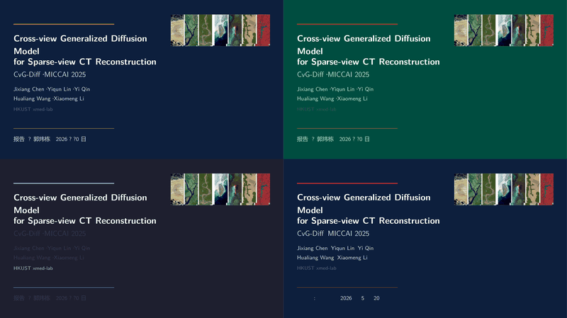
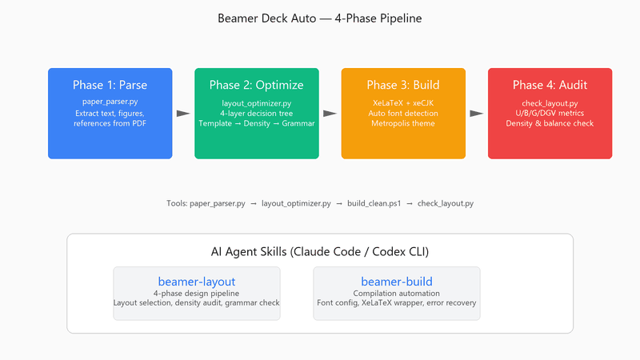
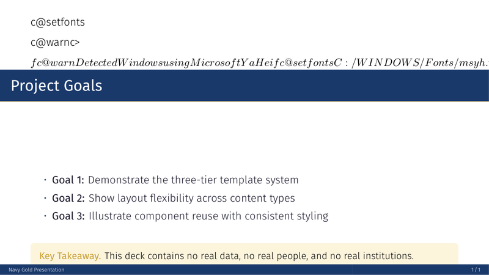
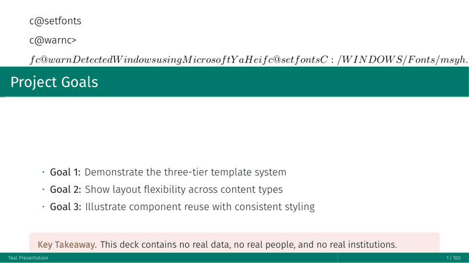
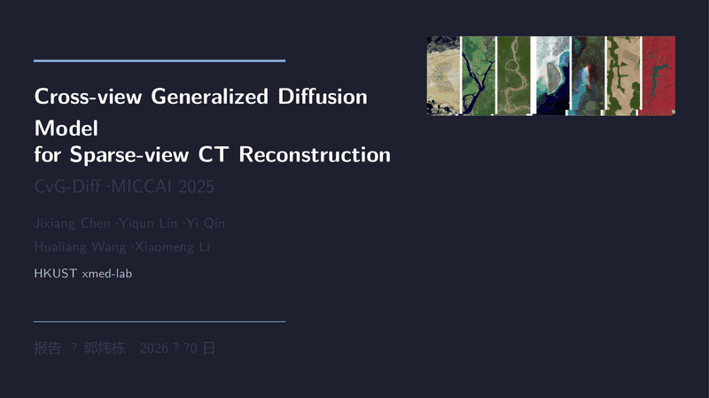
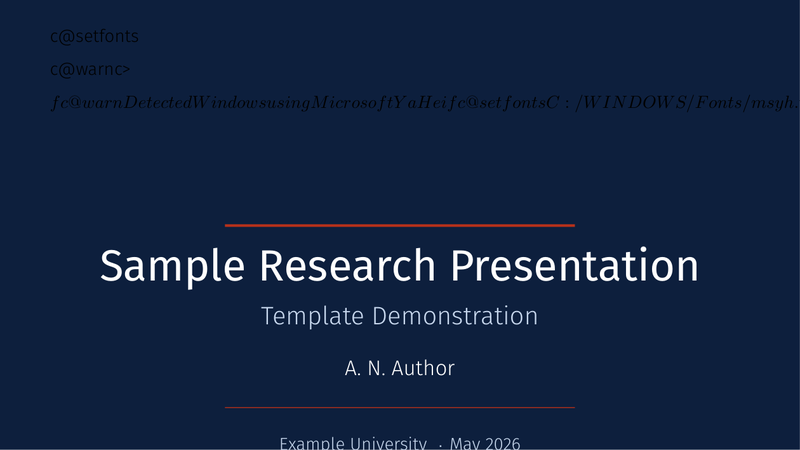
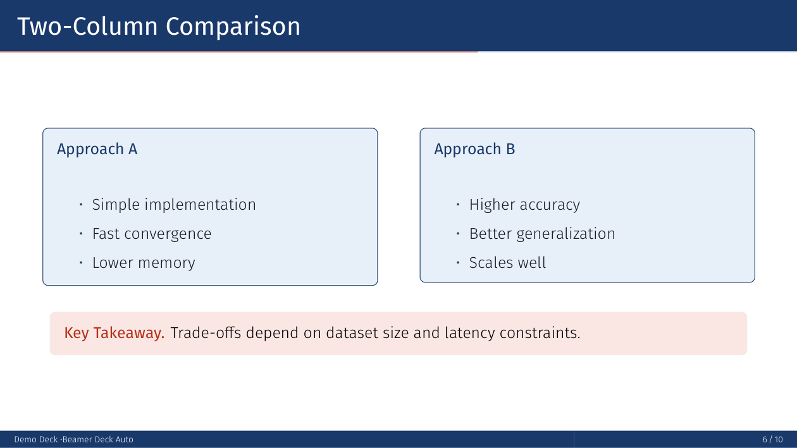
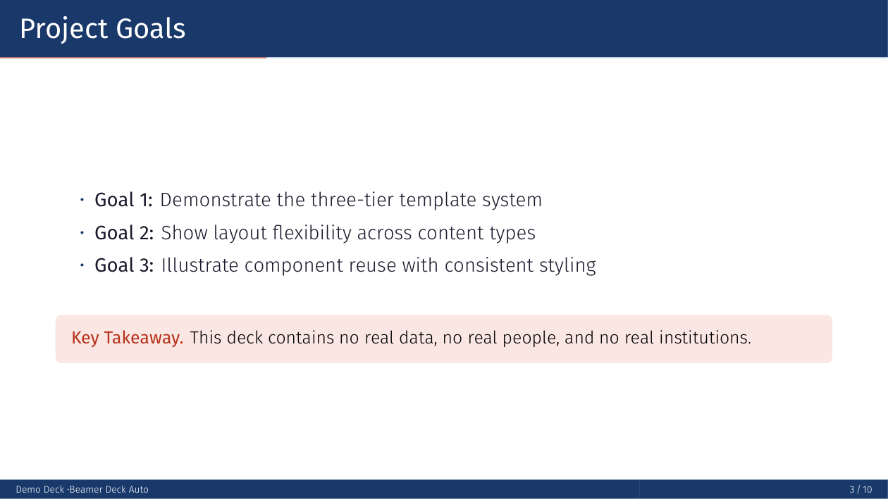
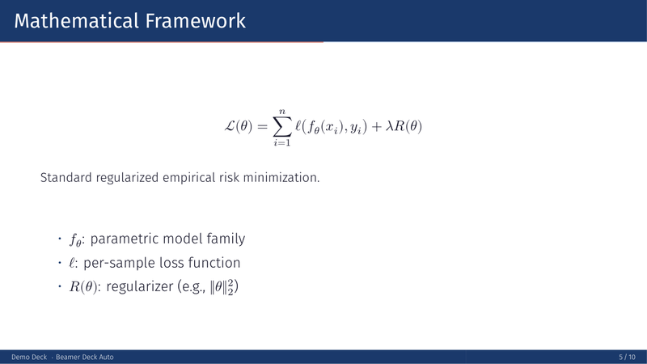

<p align="center">
  
</p>

<h1 align="center">AutoBeamer</h1>

<p align="center">
  <b>A design-engineered slide system for XeLaTeX Beamer.</b><br>
  Three-tier template library · Four-layer layout optimizer · Design grammar checker · AI agent skills
</p>

<p align="center">
  <a href="#install">Install</a> ·
  <a href="#quickstart">Quickstart</a> ·
  <a href="#features">Features</a> ·
  <a href="#showcase">Showcase</a> ·
  <a href="#requirements">Requirements</a>
</p>

---

## Install

### Claude Code (Plugin)

**Two-step install** (marketplace → plugin):

```bash
# Step 1: Add this repo as a marketplace (one-time)
/plugin marketplace add schmidtkk/auto-beamer

# Step 2: Install the plugin from the marketplace
/plugin install auto-beamer@auto-beamer-marketplace
```

> **Note:** The `@auto-beamer-marketplace` suffix is the marketplace name from `marketplace.json`. If you add the repo with a different alias, use that alias instead.

Once installed, reload plugins and the 6 skills become available under the `auto-beamer:` namespace:

| Skill | Command | What it does |
|-------|---------|--------------|
| Create | `/auto-beamer:autobeamer-create` | Full deck creation pipeline |
| Layout | `/auto-beamer:autobeamer-layout` | Layout optimization & DGV grammar |
| Build | `/auto-beamer:autobeamer-build` | Compilation & font troubleshooting |
| Review | `/auto-beamer:autobeamer-review` | Content & pedagogy review |
| TikZ | `/auto-beamer:autobeamer-tikz` | TikZ diagram quality |
| Validate | `/auto-beamer:autobeamer-validate` | Automated quantitative checks |

### Codex CLI

```bash
# Install the plugin
codex plugins install https://github.com/schmidtkk/auto-beamer

# Use a skill
codex auto-beamer:autobeamer-create "Create slides for my NeurIPS paper"
```

### Codex App (VS Code)

1. Open the **Plugins** panel in the Codex sidebar
2. Click **Add Plugin** → **From GitHub**
3. Enter: `https://github.com/schmidtkk/auto-beamer`
4. The skills appear in the command palette under `auto-beamer:`

### Cursor / OpenCode / Other Agents

For agents that support the [Agent Skills](https://agentskills.io/) open standard, copy the `skills/` directory into your project:

```bash
# Clone just the skills
git clone --depth 1 https://github.com/schmidtkk/auto-beamer.git /tmp/beamer-skills
cp -r /tmp/beamer-skills/skills/* ./.claude/skills/   # or your agent's skills dir
```

### Manual Setup (No AI Agent)

If you only want the LaTeX template library and Python tools:

```bash
git clone https://github.com/schmidtkk/auto-beamer.git
cd auto-beamer

# Install TeX dependencies (see Requirements below)
# Then use the template library directly in your .tex files
```

---

## Why AutoBeamer?

Building academic slides with LaTeX Beamer usually means:
- **Guessing layouts** — Will this figure fit on the left? Should I use `columns` or `minipage`?
- **Manual tweaking** — Adjusting `\vspace{-2ex}` until the slide stops overflowing
- **No quality gate** — "Looks fine to me" — but the audience sees unbalanced columns and loose text

**AutoBeamer** replaces guesswork with a systematic pipeline:

<p align="center">
  
</p>

1. **Parse** — Extract content from PDF papers (text, figures, references)
2. **Optimize** — 4-layer decision tree picks the best layout template automatically
3. **Build** — XeLaTeX + xeCJK with auto font detection, two-pass for perfect alignment
4. **Audit** — U/B/G/DGV metrics catch visual problems before your audience does

> **"Design before density"** — Layout choice first, content second, polish last.

---

## Features

### 🎨 Three-Tier Template Library

| Tier | What | Count | Example |
|------|------|-------|---------|
| **Themes** | Color + typography palettes | 5 | Academic, Teal, Dark, Navy+Gold, Minimal |
| **Layouts** | Page structure patterns | 8 | Text, 1-img, 2-img, 3-img, eq, table, img-top, twocol |
| **Components** | Reusable content blocks | 12+ | Info card, alert, result, equation box, figure helper |

<p align="center">
  
  
</p>
<p align="center">
  
  
</p>

### 🧠 Four-Layer Layout Optimizer

`layout_optimizer.py` makes layout decisions like a senior designer:

| Layer | Decision | Example |
|-------|----------|---------|
| **L1 Template** | Aspect ratio → layout family | Wide figure → `imgtop` · Square figure → `1img` side |
| **L2 Constraints** | Column balance, natural image height | Prevent 30/70 splits, cap image at 76% frame height |
| **L3 Density** | Text fills 60–85% of slot | Too sparse → add content; too dense → split slide |
| **L4 Grammar** | Hard design rules | No loose text outside boxes · No gold callout in columns · Max 3 blocks/slide |

```bash
# Get layout suggestion for a wide image + 2 takeaway cards
python tools/layout_optimizer.py suggest --img 1716:1124 --cards 2
# → Recommended: imgtop layout, auto-capped height, 2 bluecards bottom
```

### 🔍 Design Grammar Checker

`check_layout.py` measures every frame with 4 metrics:

| Metric | Target | What it catches |
|--------|--------|-----------------|
| **U** Utilization | 0.80–0.95 | Wasted space or overcrowding |
| **B** Column Balance | > 0.80 | Lopsided two-column layouts |
| **G** Gravity Deviation | < 0.15 | Content drifting too high or low |
| **DGV** Grammar Violations | 0 | Loose text, bad block placement, stacked cards |

```bash
# Audit a compiled deck
python tools/check_layout.py deck.tex build/deck.log --advise
```

### 🤖 AI Agent Skills

Pre-built skills for **Claude Code**, **Codex CLI**, and any agent supporting the [Agent Skills](https://agentskills.io/) standard — your agent knows the pipeline:

| Skill | Triggers On | What It Does | Invocation |
|-------|-------------|--------------|------------|
| `autobeamer-build` | Compilation errors, font issues, build failures | XeLaTeX wrapper, auto font config, error recovery | `/auto-beamer:autobeamer-build` |
| `autobeamer-create` | Create a new deck from scratch | Material analysis → interview → structure → draft → figures | `/auto-beamer:autobeamer-create` |
| `autobeamer-layout` | Layout questions, overflow, image scaling | 4-phase design pipeline: theme → draft → optimize → polish | `/auto-beamer:autobeamer-layout` |
| `autobeamer-review` | Proofread, audit, pedagogy check | `proofread`, `audit`, `pedagogy`, `excellence`, `devil's-advocate` | `/auto-beamer:autobeamer-review` |
| `autobeamer-tikz` | TikZ diagram quality | Accuracy rules, 6 patterns, iterative review | `/auto-beamer:autobeamer-tikz` |
| `autobeamer-validate` | Automated quantitative checks | `validate`, `visual-check`, `check` | `/auto-beamer:autobeamer-validate` |

---

## Showcase

### Demo Deck — Fictional Research

<table>
<tr>
<td width="50%">
<b>Hero Slide</b><br>
<small>Title slide with gradient background and institution branding.</small><br>

</td>
<td width="50%">
<b>Two-Column Comparison</b><br>
<small>Side-by-side info blocks with contrasting approaches.</small><br>

</td>
</tr>
<tr>
<td width="50%">
<b>Equation Slide</b><br>
<small>Display math with loss function and definition cards.</small><br>

</td>
<td width="50%">
<b>Key Findings</b><br>
<small>Highlighted results with conclusion block.</small><br>

</td>
</tr>
</table>

### Template Library Demo

All 4 themes × 8 layouts × component variations in a single reference deck: `template-lib-demo.tex`

---

## Quickstart

### 1. Install the Plugin (choose your agent)

**Claude Code:**
```bash
/plugin install https://github.com/schmidtkk/auto-beamer
```

**Codex CLI:**
```bash
codex plugins install https://github.com/schmidtkk/auto-beamer
```

**Cursor / OpenCode / Generic Agent:**
```bash
git clone --depth 1 https://github.com/schmidtkk/auto-beamer.git /tmp/bda
cp -r /tmp/bda/skills/* ./.claude/skills/
```

### 2. Install TeX Dependencies

**Windows:**
1. Install [TeX Live](https://tug.org/texlive/) or [MiKTeX](https://miktex.org/)
2. Ensure `xelatex` is in your PATH
3. CJK fonts: Microsoft YaHei (built-in)

**Linux:**
```bash
chmod +x install-linux.sh
./install-linux.sh   # TeX Live + Noto Sans CJK + Python deps
```

**macOS:**
```bash
brew install mactex-no-gui
brew install font-noto-sans-cjk-sc
```

> After installation, the AI agent handles building, layout selection, and auditing via the `autobeamer-layout` and `autobeamer-build` skills.

### 3. Create Your First Deck

**With Claude Code:**
```bash
/auto-beamer:autobeamer-create "Create a 15-slide deck for my NeurIPS paper on diffusion models"
```

**With Codex CLI:**
```bash
codex auto-beamer:autobeamer-create "Create slides for my group meeting on optimal transport"
```

The skill will:
1. Ask clarifying questions (audience, tone, duration)
2. Generate a structured outline
3. Draft slides iteratively with compile checks
4. Run the quality loop (validate → review → fix)

---

## The Workflow

```
┌─────────────┐    ┌─────────────┐    ┌─────────────┐    ┌─────────────┐
│   Parse     │ →  │   Optimize  │ →  │    Build    │ →  │    Audit    │
│  (optional) │    │  (required) │    │  (required) │    │  (required) │
└─────────────┘    └─────────────┘    └─────────────┘    └─────────────┘
     │                   │                   │                   │
 paper_parser.py    layout_optimizer.py   build_clean.ps1   check_layout.py
     │                   │                   │                   │
  Extract text      Pick template        XeLaTeX × 2        U/B/G/DGV
  Figures, refs     Generate skeleton    Auto font detect   Grammar check
  Section map       Fix density/balance  PNG screenshots    Fix or flag
```

**Phase -1: Parse** (optional) — Starting from a PDF paper? `paper_parser.py` extracts sections, figures, and text into a structured JSON. Map sections → slides.

**Phase 0: Theme** — Pick audience + tone → lock in a theme from the template library.

**Phase 1: Draft** — Generate raw slide content. The optimizer suggests layouts per slide.

**Phase 2: Optimize** — Compile, run the grammar checker, fix DGV → Geometry → Density in order.

**Phase 3: Polish** — Two-pass XeLaTeX build, generate PNG screenshots, present for review.

---

## Project Structure

```
.
├── README.md                          # This file
├── CLAUDE.md                          # Project context for AI agents
├── AGENTS.md                          # Agent guidelines
├── skills/
│   ├── autobeamer-build/SKILL.md          # Compilation & font troubleshooting
│   ├── autobeamer-create/SKILL.md         # Full deck creation pipeline
│   ├── autobeamer-layout/SKILL.md         # Layout optimization & DGV grammar
│   ├── autobeamer-review/SKILL.md         # Content & pedagogy review
│   ├── autobeamer-tikz/SKILL.md           # TikZ diagram quality
│   └── autobeamer-validate/SKILL.md       # Automated quantitative checks
├── template-lib/                      # Three-tier template library
│   ├── template-lib.sty               # Master entry point
│   ├── themes/                        # 4 color themes
│   ├── layouts/                       # 8 layout patterns
│   ├── components/                    # Reusable blocks
│   └── docs/CATALOG.md                # Full API reference
├── tools/                             # Layout & audit tools
│   ├── layout_optimizer.py            # 4-layer decision tree
│   ├── check_layout.py                # U/B/G/DGV metrics
│   ├── paper_parser.py                # PDF paper extraction
│   ├── auto_crop.py                   # Image white-margin cropper
│   └── README.md                      # Tool reference
├── theme-library/                     # Minimal theme previews
├── personal-deck/                     # Real academic decks (examples)
└── assets/teaser/                     # Promotional assets
```

---

## Documentation

| Document | Purpose |
|----------|---------|
| [`CLAUDE.md`](CLAUDE.md) | Project context, box macros, height alignment rules, build commands |
| [`AGENTS.md`](AGENTS.md) | Agent guidelines, tool reference, key constraints |
| [`template-lib/docs/CATALOG.md`](template-lib/docs/CATALOG.md) | Full theme/layout/component API reference |
| [`tools/README.md`](tools/README.md) | Tool usage examples and CLI reference |
| [`skills/autobeamer-build/SKILL.md`](skills/autobeamer-build/SKILL.md) | AI skill: compilation & font troubleshooting |
| [`skills/autobeamer-create/SKILL.md`](skills/autobeamer-create/SKILL.md) | AI skill: full deck creation pipeline |
| [`skills/autobeamer-layout/SKILL.md`](skills/autobeamer-layout/SKILL.md) | AI skill: layout optimization & DGV grammar |
| [`skills/autobeamer-review/SKILL.md`](skills/autobeamer-review/SKILL.md) | AI skill: content & pedagogy review |
| [`skills/autobeamer-tikz/SKILL.md`](skills/autobeamer-tikz/SKILL.md) | AI skill: TikZ diagram quality |
| [`skills/autobeamer-validate/SKILL.md`](skills/autobeamer-validate/SKILL.md) | AI skill: automated quantitative checks |

---

## Requirements

| Component | Version | Notes |
|-----------|---------|-------|
| XeLaTeX | TeX Live ≥ 2022 | Required for `fontspec` + `xeCJK` |
| Python | 3.10+ | For layout optimizer and grammar checker |
| `metropolis` | Beamer theme | Included in TeX Live |
| LaTeX packages | — | `adjustbox`, `tcolorbox`, `booktabs`, `xeCJK`, `unicode-math` |

---

## Contributing

1. Fork the repository
2. Create a feature branch
3. Follow the `autobeamer-layout` skill for new layouts
4. Run `check_layout.py` before submitting
5. Submit a PR with clear description

---

## Acknowledgements

- **[Noi1r/beamer-skill](https://github.com/Noi1r/beamer-skill/)** — Skill instruction and semantic inline command patterns that inspired our `\TLpos`/`\TLneg`/`\TLhl`/`\TLmuted` commands.
- **Open-source Beamer community** — Theme galleries, layout ideas, and best-practice patterns from the broader LaTeX ecosystem.

## License

MIT License — see [LICENSE](LICENSE) file for details.

---

<p align="center">
  <i>Built for researchers who care about how their slides look.</i>
</p>
